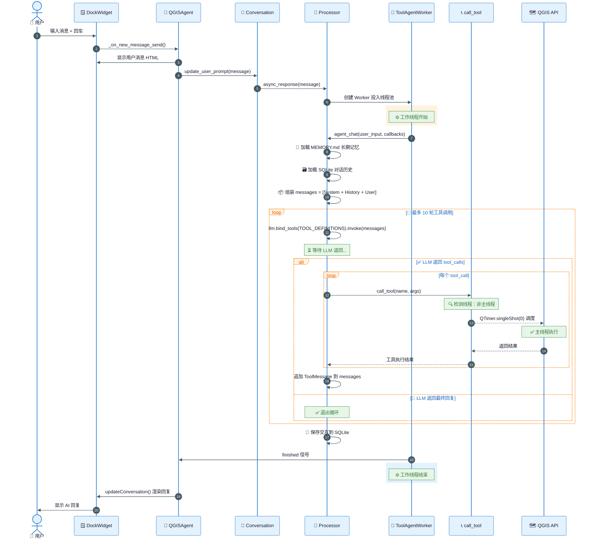
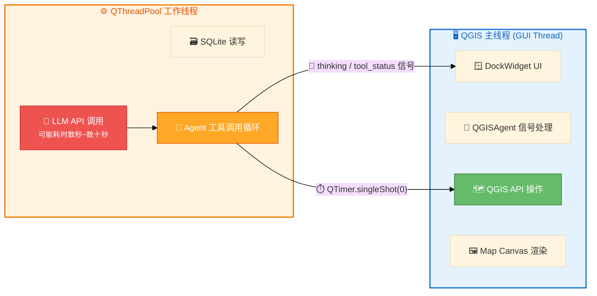
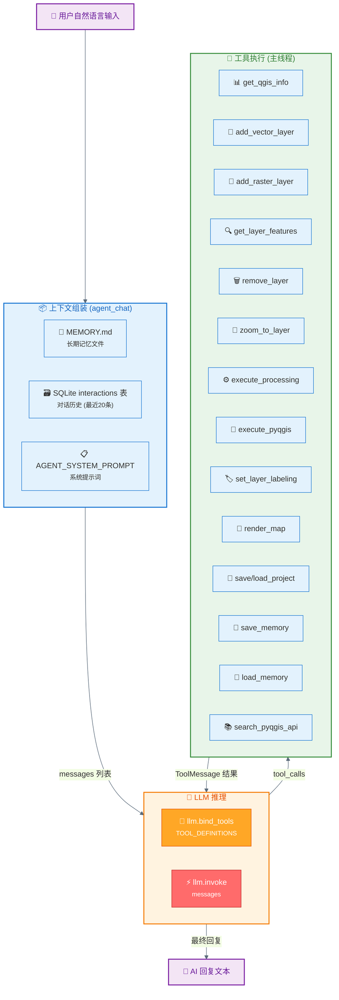
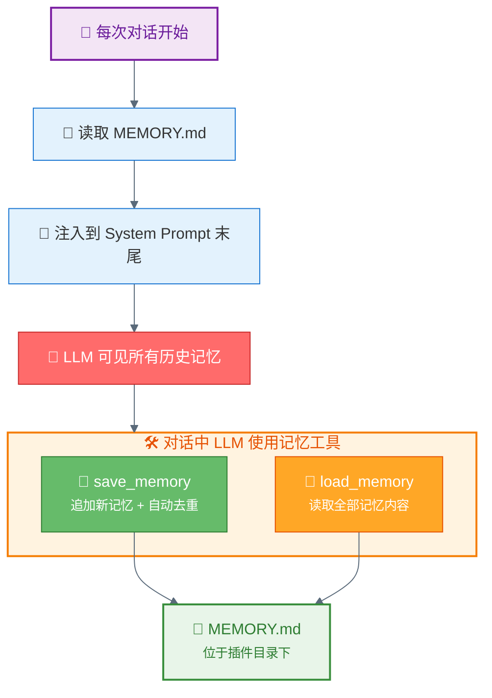
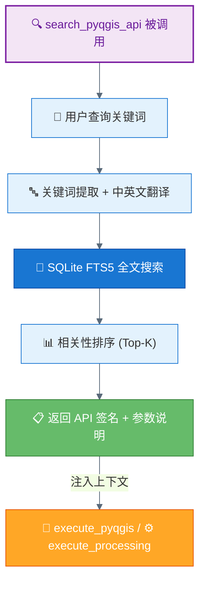
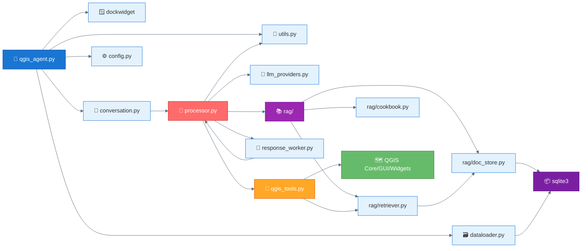

# QGIS Agent 项目上下文

> QGIS 桌面插件，将 LLM Agent 嵌入 QGIS，支持通过自然语言调用 15 个 QGIS 工具完成地理空间操作。集成 RAG API 文档检索和 Cookbook 自我进化机制。

---

## 项目架构总览

```mermaid
%%{init: {'theme': 'base', 'themeVariables': { 'primaryColor': '#4a9eff', 'primaryTextColor': '#fff', 'primaryBorderColor': '#2b7cd3', 'lineColor': '#5a6a7a', 'secondaryColor': '#ffa726', 'tertiaryColor': '#e8f4fd'}}}%%
graph TB
    subgraph UI["🖥️ QGIS 主线程"]
        direction LR
        A["🧩 QGISAgent<br/><small>qgis_agent.py</small>"]
        B["🪟 DockWidget<br/><small>qgis_agent_dockwidget.py</small>"]
        C["💬 Conversation<br/><small>conversation.py</small>"]
    end

    subgraph WORKER["⚙️ 工作线程 (QThreadPool)"]
        direction LR
        D["🔧 ToolAgentWorker<br/><small>response_worker.py</small>"]
        E["🧠 Processor.agent_chat()<br/><small>processor.py</small>"]
    end

    subgraph TOOLS["🔩 主线程调度"]
        direction LR
        F["📞 call_tool()<br/><small>qgis_tools.py</small>"]
        G["🧰 15 QGIS 工具函数"]
        H["🗺️ QGIS API<br/><small>QgsProject / iface / Processing</small>"]
    end

    subgraph EXT["☁️ 外部"]
        I["🤖 LLM API<br/><small>DeepSeek / OpenAI 兼容</small>"]
    end

    A -->|创建/管理| B
    A -->|创建/管理| C
    C -->|async_response()| D
    D -->|在线程中运行| E
    E -->|LLM API 调用| I
    E -->|跨线程调用工具| F
    F -->|QTimer.singleShot 调度到主线程| G
    G -->|操作| H
    E -->|thinking 信号| B
    E -->|finished 信号| A

    style UI fill:#e3f2fd,stroke:#1976d2,stroke-width:2px,color:#1565c0
    style WORKER fill:#fff3e0,stroke:#f57c00,stroke-width:2px,color:#e65100
    style TOOLS fill:#e8f5e9,stroke:#388e3c,stroke-width:2px,color:#2e7d32
    style EXT fill:#fce4ec,stroke:#c62828,stroke-width:2px,color:#b71c1c
    style A fill:#1976d2,stroke:#0d47a1,color:#fff
    style E fill:#ff6b6b,stroke:#c62828,color:#fff
    style F fill:#ffa726,stroke:#e65100,color:#fff
    style G fill:#66bb6a,stroke:#2e7d32,color:#fff
```

---

## 调用链路详解



---

## 线程模型



**关键设计原则**：
- LLM API 调用在工作线程中执行，**不阻塞 QGIS 主线程 UI**
- 所有 QGIS API 操作通过 `QTimer.singleShot(0)` 调度回主线程执行，**保证线程安全**
- 工作线程用 `QEventLoop.processEvents()` 同步等待主线程执行结果
- 超时时间：60 秒

---

## 数据流向



---

## 15 个 QGIS 工具

| # | 工具名 | 功能 | 关键 QGIS API |
|---|--------|------|---------------|
| 1 | `save_memory` | 保存长期记忆（追加到 MEMORY.md） | 文件 I/O + 去重 |
| 2 | `load_memory` | 读取长期记忆文件全部内容 | 文件 I/O |
| 3 | `search_pyqgis_api` | 检索 PyQGIS/GDAL/Processing API 文档 | `rag.retriever` → SQLite FTS5 |
| 4 | `get_qgis_info` | 获取版本、项目路径、CRS、图层列表 | `QgsProject.instance()`, `Qgis.QGIS_VERSION` |
| 5 | `get_layer_features` | 获取矢量图层属性表 + 几何 WKT | `layer.getFeatures()`, `feature.geometry().asWkt()` |
| 6 | `add_vector_layer` | 添加矢量图层 | `QgsVectorLayer()`, `QgsProject.addMapLayer()` |
| 7 | `add_raster_layer` | 添加栅格图层 | `QgsRasterLayer()`, `QgsProject.addMapLayer()` |
| 8 | `remove_layer` | 移除图层 | `QgsProject.removeMapLayer()` |
| 9 | `zoom_to_layer` | 缩放到图层范围 | `iface.setActiveLayer()`, `iface.zoomToActiveLayer()` |
| 10 | `execute_processing` | 执行 Processing 算法 | `processing.run()` |
| 11 | `execute_pyqgis` | 执行任意 PyQGIS 代码 | `exec()` + stdout/stderr 重定向 |
| 12 | `set_layer_labeling` | 设置矢量图层标注（字体/颜色/缓冲/位置） | `QgsPalLayerSettings` |
| 13 | `save_project` | 保存项目文件 | `QgsProject.write()` |
| 14 | `load_project` | 加载项目文件 | `QgsProject.read()`, `iface.mapCanvas().refresh()` |
| 15 | `render_map` | 渲染地图为 PNG | `QgsMapRendererParallelJob` |

---

## 长期记忆机制



**记忆文件路径**：`{QGIS Profile}/python/plugins/qgis_agent/MEMORY.md`
**去重逻辑**：如果内容已存在于文件中，跳过保存
**长度限制**：注入时截断到 4000 字符，`load_memory` 工具返回上限 8000 字符

---

## RAG API 文档检索



**模块**：`rag/doc_store.py`（SQLite FTS5 索引） + `rag/retriever.py`（检索逻辑） + `rag/doc_generator.py`（文档生成）
- 首次运行自动构建 PyQGIS API 索引（从 QGIS 运行时反射）
- `execute_pyqgis` 和 `execute_processing` 执行前自动检索相关 API 文档
- 支持中英文关键词搜索

---

## Cookbook 自我进化


**模块**：`rag/cookbook.py`
- 每次工具成功执行后自动归档案例（任务描述 + 工具调用 + 结果摘要）
- 新任务开始时检索相似历史案例，帮助 LLM 更快找到正确方案
- 质量评分机制：高分案例优先注入

---

## 对话历史存储

- **存储引擎**：SQLite（`QGIS_Agent.db`）
- **核心表**：`interactions`（每条消息一行）、`conversations`（对话元信息）、`llm_config`（LLM 配置）
- **加载策略**：`agent_chat` 开始时从数据库读取最近 20 条（10 轮对话），拼入 `messages` 列表
- **格式**：`typeMessage=input` → `HumanMessage`，`typeMessage=return` → `AIMessage`

---

## 模块依赖图



---

## 关键配置

| 配置项 | 来源 | 默认值 |
|--------|------|--------|
| LLM Provider | `llm_config` 表 / 设置对话框 | DeepSeek |
| LLM Model | `llm_config` 表 | deepseek-chat |
| API Endpoint | `llm_config` 表 / 环境变量 | `https://api.deepseek.com/v1` |
| API Key | 环境变量 `DEEPSEEK_API_KEY` | — |
| 最大工具轮次 | `processor.py` | 10 |
| 历史消息上限 | `processor.py` | 20 条 |
| 工具执行超时 | `qgis_tools.py` | 60 秒 |
| 记忆注入长度上限 | `processor.py` | 4000 字符 |

---

## 常见问题速查

| 问题 | 原因 | 修复位置 |
|------|------|----------|
| Map Canvas 停止渲染 | 工具在工作线程调用 QGIS API | `qgis_tools.py:call_tool()` 已修复为 QTimer 主线程调度 |
| LLM 遗忘上下文 | `agent_chat` 未加载历史 | `processor.py` 已修复：加载 SQLite 历史 + MEMORY.md |
| `set_font_color` NameError | 局部导入未存为实例属性 | `qgis_agent.py` 已修复为 `self._set_font_color` |
| 文本未左对齐 | HTML div 缺少 `text-align:left` | `qgis_agent_dockwidget.py` 已修复 |
| `cbSkipConfirm` NoneType 错误 | dockwidget 创建在信号连接之后 | `qgis_agent.py:_init_plugin()` 已修复：dockwidget 创建前置 |
| GitHub 文件内容乱码 | API push 时双重 base64 编码 | 使用 `/git/blobs` API + sha 构建 tree |
| `requirements.txt` 缺少 `langchain_core` | 依赖声明不完整 | 代码中 `required_modules` 含 `langchain_core`，但 `requirements.txt` 未声明 |
