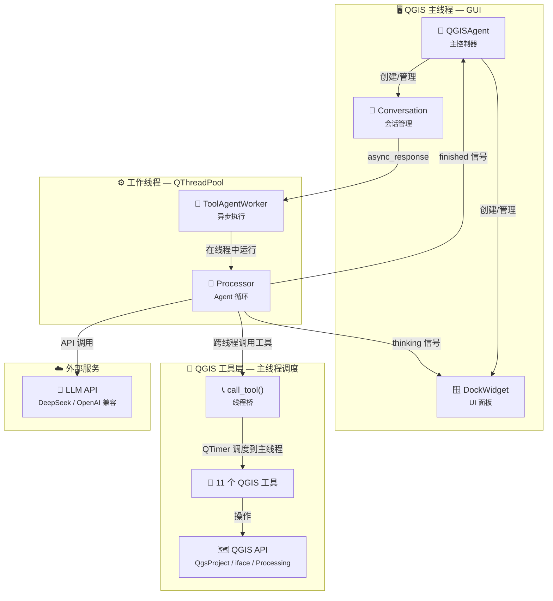
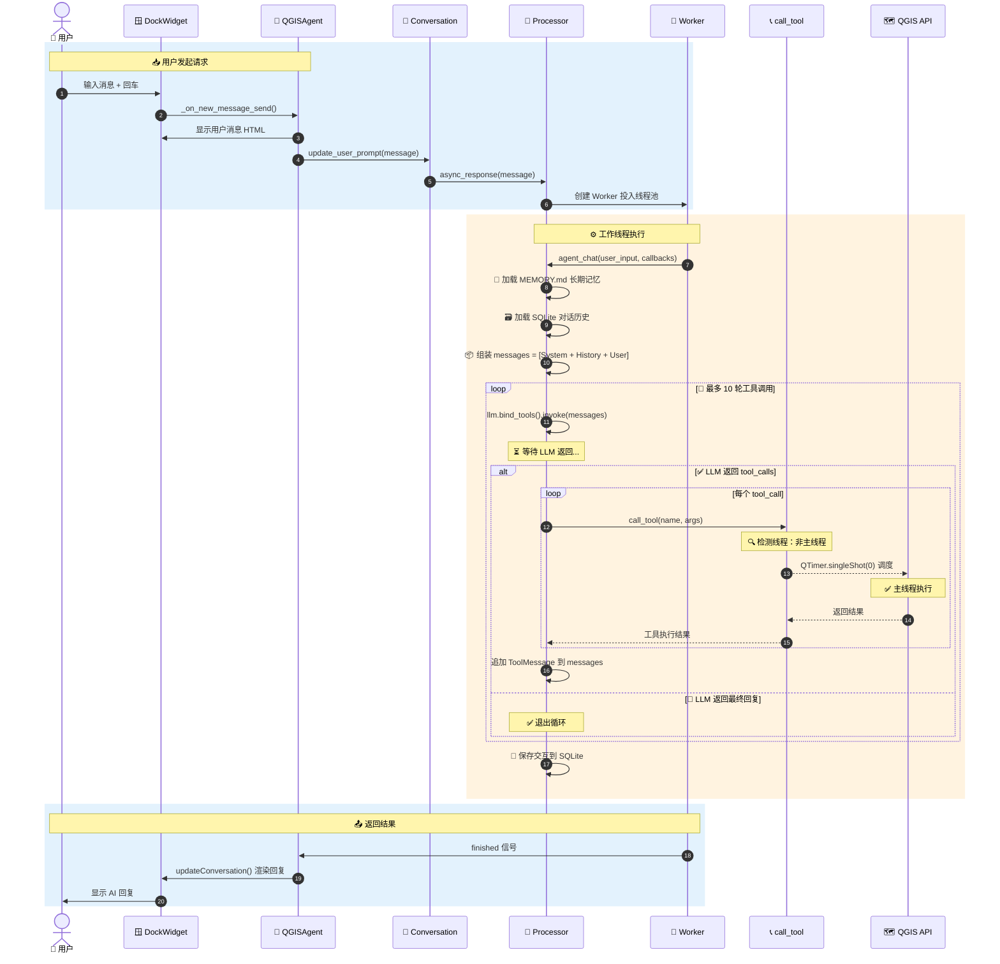
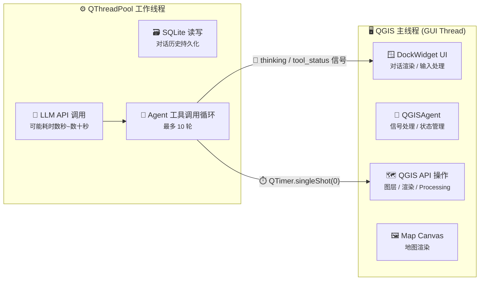
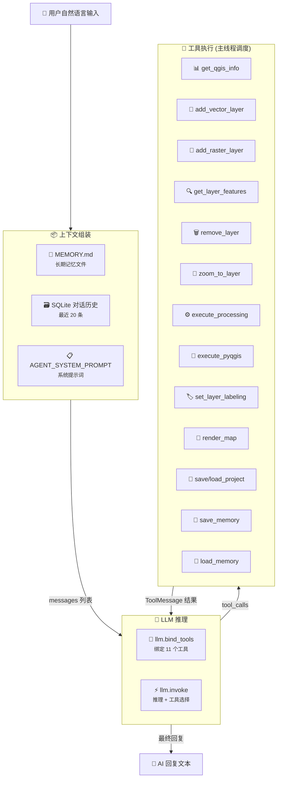

# QGIS Agent

> 🗺️ 将大语言模型 (LLM) 嵌入 QGIS 的智能助手插件 —— 用自然语言操控 QGIS 完成地理空间任务。

[](https://qgis.org/)
[](https://www.python.org/)
[](LICENSE)

---

## 架构概览



## 调用流程



## 线程模型



> **核心设计原则**：
> - LLM API 调用在工作线程中执行，**不阻塞 QGIS 主线程 UI**
> - 所有 QGIS API 操作通过 `QTimer.singleShot(0)` 调度回主线程执行，**保证线程安全**
> - 工作线程通过信号/槽同步等待主线程执行结果，超时 60 秒

## 数据流



## 功能特性

- 💬 **自然语言交互** — 在 QGIS 内直接对话，无需编写代码
- 🧰 **11 个内置工具** — 图层管理、数据处理、地图渲染、项目保存等
- 🧠 **多 LLM 支持** — DeepSeek、OpenAI、智谱 GLM、Gemini、小米 MiMo 等
- 🧵 **线程安全** — LLM 调用不阻塞 UI，QGIS API 操作安全调度
- 💾 **对话持久化** — SQLite 存储完整对话历史，支持检索与恢复
- 📝 **长期记忆** — 跨对话记忆，AI 记住你的偏好和工作习惯
- 🎨 **标注支持** — 一键设置图层标注样式

## 支持的 LLM

> 任何兼容 OpenAI API 格式的服务均可接入。

## 安装

### 方式一：QGIS 插件管理器安装 (推荐)

1. 下载 `qgis_agent.zip`
2. QGIS → 插件 → 管理和安装插件 → 从 ZIP 安装
3. 选择 `qgis_agent.zip` 安装

### 方式二：手动安装

```bash
# 复制到 QGIS 插件目录
cp -r qgis_agent/ ~/.local/share/QGIS/QGIS3/profiles/default/python/plugins/

# 安装依赖
pip install -r requirements.txt
```

## 配置

1. 在 QGIS 中打开插件面板
2. 切换到「模型配置」标签页
3. 添加 LLM 配置（名称、API 端点、API Key）
4. 或通过环境变量配置：
   - `DEEPSEEK_API_KEY` — DeepSeek API Key
   - `OPENAI_API_KEY` — OpenAI API Key
   - 其他提供商同理

## 使用方法

1. 点击工具栏 **QGIS Agent** 图标或菜单 **插件 → QGIS Agent**
2. 在底部输入框输入自然语言指令，例如：
   - `添加图层 D:/data/roads.shp`
   - `查看当前项目有哪些图层`
   - `对建筑图层按高度字段分级设色`
   - `将地图渲染导出为 PNG`
3. AI 会自动选择并调用合适的 QGIS 工具完成任务

## 内置工具

| 工具 | 功能 |
|------|------|
| `get_qgis_info` | 获取 QGIS 项目信息、图层列表 |
| `add_vector_layer` | 添加矢量图层 |
| `add_raster_layer` | 添加栅格图层 |
| `get_layer_features` | 查询图层要素属性 |
| `remove_layer` | 移除图层 |
| `zoom_to_layer` | 缩放到图层范围 |
| `execute_processing` | 执行 Processing 算法 |
| `execute_pyqgis` | 执行任意 PyQGIS 代码 |
| `set_layer_labeling` | 设置图层标注 |
| `render_map` | 渲染地图截图 |
| `save_project` / `load_project` | 保存/加载项目 |

## 项目结构

```
qgis_agent/
├── __init__.py                  # 插件入口
├── qgis_agent.py                # 主控制器
├── processor.py                 # LLM Agent 核心
├── qgis_tools.py                # QGIS 工具集 + 线程桥
├── conversation.py              # 对话会话管理
├── response_worker.py           # 多线程 Worker
├── dataloader.py                # SQLite 数据层
├── llm_providers.py             # LLM 提供商工厂
├── utils.py                     # 工具函数
├── config.py                    # 全局配置
├── package_manager.py           # 依赖管理
├── resources/prompt.json        # 提示词模板
├── tests/                       # 单元测试
├── icon.png                     # 插件图标
├── metadata.txt                 # QGIS 插件元数据
├── requirements.txt             # Python 依赖
├── README.md                    # 项目说明
├── CHANGELOG.md                 # 更新日志
└── LICENSE                      # 开源许可
```

## 开发

```bash
# 运行测试
python -m pytest tests/ -v

# 生成图标
python generate_icon.py
```

## 许可

[MIT](LICENSE)
