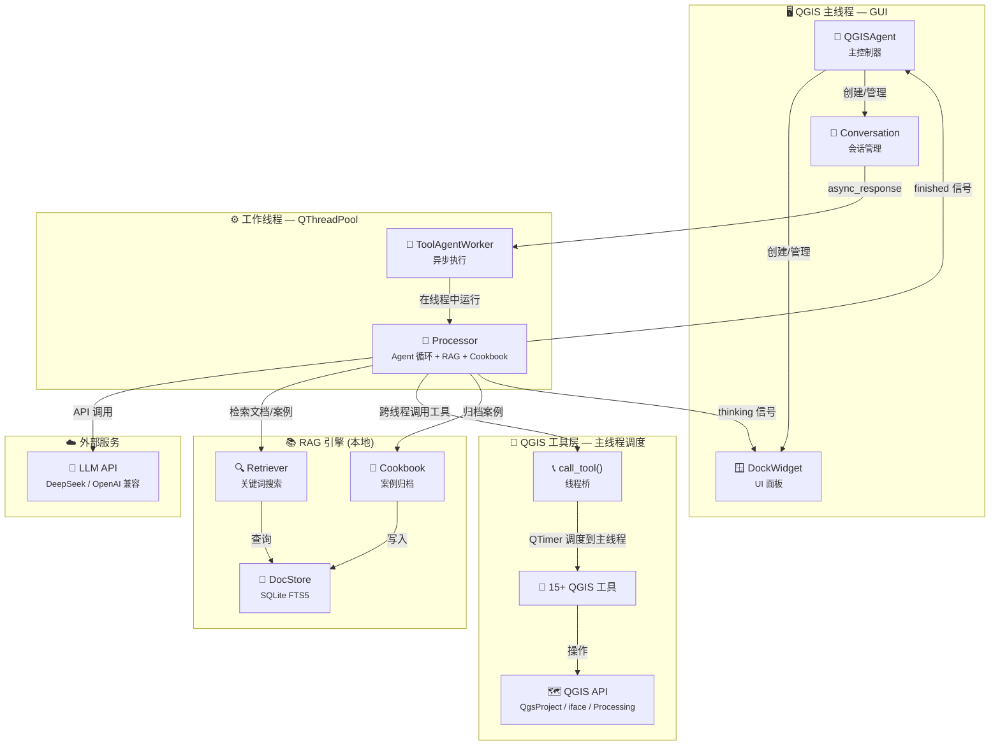

# QGIS Agent

> 🗺️ 将大语言模型 (LLM) 嵌入 QGIS 的智能助手插件 —— 用自然语言操控 QGIS 完成地理空间任务。

[](https://qgis.org/)
[](https://www.python.org/)
[](CHANGELOG.md)
[](LICENSE)

---

## 🎯 一句话简介

QGIS Agent 是 QGIS 的 AI 原生插件——用自然语言直接操控 QGIS，无需编写 PyQGIS 代码。集成 **RAG API 文档检索**和 **Cookbook 自我进化**，让 AI 写的代码更准确、越用越聪明。

## ✨ 核心亮点

| 亮点 | 说明 |
|------|------|
| 📚 **RAG API 文档检索** | 本地 SQLite FTS5 全文引擎，执行代码前自动查询 PyQGIS API 签名和参数 |
| 🧬 **Cookbook 自我进化** | 成功任务自动归档为案例，下次执行前检索相似案例注入上下文 |
| 📖 **官方 API 文档** | 内置 71 条官方 API 文档，覆盖核心类的完整方法签名 |
| 🔒 **代码安全确认** | 执行 PyQGIS/Processing 前弹窗确认，杜绝误操作 |
| 🧵 **线程安全** | LLM 调用在工作线程执行，QGIS API 操作通过 QTimer 调度回主线程 |
| 🧠 **多模型** | 支持 DeepSeek、OpenAI、GLM、Gemini、MiMo 等所有 OpenAI 兼容 API |
| 🔌 **Skills 系统** | 可扩展的技能插件架构，支持网络搜索、GIS 数据查询等功能 |
| 🐛 **SmartDebugger** | 智能调试系统，20+种错误模式识别，自动提供修复建议 |
| 📊 **Task Graph** | 任务流程图可视化，NetworkX + PyVis 支持 |
| 🎯 **Query Tuning** | 用户查询优化，自动分解 GIS 任务 |
| 📋 **Tool Docs** | TOML 格式工具文档，支持 RAG 检索 |
| 🔍 **Code Review** | 代码审查机制，确保生成代码正确性 |

## 🏗️ 架构概览



## 📥 安装

### 方式一：QGIS ZIP 安装（推荐）

1. 从 [Releases](https://github.com/bunkmr/qgis-agent/releases) 下载最新版 `qgis_agent_vX.X.X.zip`
2. 打开 QGIS → 菜单栏 **插件** → **管理和安装插件**
3. 点击左侧 **从 ZIP 安装**，选择下载的 ZIP 文件
4. 点击 **安装插件**
5. 在已安装列表中勾选启用 **QGIS Agent**

### 方式二：手动安装

#### Windows

```powershell
# 1. 复制到 QGIS 插件目录
Copy-Item -Recurse qgis_agent\ "$env:APPDATA\QGIS\QGIS3\profiles\default\python\plugins\qgis_agent"

# 2. 重启 QGIS，在 插件 → 管理和安装插件 中启用 QGIS Agent
```

#### macOS / Linux

```bash
cp -r qgis_agent/ ~/.local/share/QGIS/QGIS3/profiles/default/python/plugins/
```

## ⚙️ 配置

1. 打开 QGIS，点击工具栏 **QGIS Agent** 图标
2. 切换到「模型配置」标签页
3. 添加 LLM 配置：
   - **名称**：任意（如 `DeepSeek`）
   - **API 端点**：如 `https://api.deepseek.com/v1`
   - **API Key**：你的密钥

### 支持的 LLM 提供商

| 提供商 | API 端点 | 模型 |
|--------|----------|------|
| DeepSeek | `https://api.deepseek.com/v1` | deepseek-chat, deepseek-reasoner |
| OpenAI | `https://api.openai.com/v1` | gpt-4o, gpt-4o-mini |
| 智谱 GLM | `https://open.bigmodel.cn/api/paas/v4/` | glm-4, glm-4-flash |
| Google | `https://generativelanguage.googleapis.com/v1beta/openai/` | gemini-2.0-flash |
| 小米 MiMo | `https://api.xiaomimimo.com/v1/chat/completions` | mimo-v2.5 |
| 自定义 | 任何 OpenAI 兼容接口 | 任意模型名 |

## 🚀 快速上手

在 QGIS Agent 面板输入框中输入自然语言指令：

| 示例指令 | 效果 |
|----------|------|
| `添加图层 D:/data/roads.shp` | 加载矢量图层到当前项目 |
| `查看当前项目有哪些图层` | 列出所有图层及属性 |
| `对建筑图层按高度字段分级设色` | 自动设置分级符号化渲染 |
| `以 selected_layer 为输入做 100m 缓冲区` | 执行缓冲区空间分析 |
| `将地图渲染导出为 PNG` | 导出当前地图画布截图 |

> 💡 **提示**：AI 在执行 PyQGIS 代码前会自动检索 API 文档，确保参数准确。

## 🔧 内置工具

| 工具 | 功能 | 分类 |
|------|------|------|
| `get_qgis_info` | 获取 QGIS 项目信息、图层列表 | 📊 查询 |
| `get_layer_features` | 查询图层要素属性 | 📊 查询 |
| `add_vector_layer` | 添加矢量图层 | 📂 图层管理 |
| `add_raster_layer` | 添加栅格图层 | 📂 图层管理 |
| `remove_layer` | 移除图层 | 📂 图层管理 |
| `zoom_to_layer` | 缩放到图层范围 | 🔎 导航 |
| `set_layer_labeling` | 设置图层标注 | 🏷️ 标注 |
| `execute_processing` | 执行 Processing 算法 | ⚙️ 空间分析 |
| `execute_pyqgis` | 执行任意 PyQGIS 代码 | 🐍 高级操作 |
| `search_pyqgis_api` | 检索 PyQGIS API 文档 | 📚 RAG |
| `render_map` | 渲染地图截图 | 📸 输出 |
| `save_project` | 保存 QGIS 项目 | 💾 项目 |
| `load_project` | 加载 QGIS 项目 | 💾 项目 |
| `save_memory` | 保存长期记忆 | 🧠 记忆 |
| `load_memory` | 加载长期记忆 | 🧠 记忆 |

## 📚 RAG API 文档覆盖

RAG 系统包含以下来源的 API 文档：

| 来源 | 数量 | 说明 |
|------|------|------|
| 官方 API 文档 | 71 | 核心类的完整方法签名（QgsVectorLayer, QgsGeometry, QgsFeature 等） |
| 运行时反射 | 200+ | 从 QGIS 运行时提取的方法签名 |
| Processing 算法 | 100+ | 所有已安装的 Processing 算法 |
| 手动补充 | 11 | 常用操作速查 |
| **总计** | **380+** | 完整的 QGIS API 覆盖 |

### 覆盖的核心类

- **QgsVectorLayer** (17 methods) - 矢量图层操作
- **QgsGeometry** (16 methods) - 几何操作
- **QgsProject** (11 methods) - 项目管理
- **QgsCoordinateReferenceSystem** (9 methods) - 坐标系
- **QgsFeature** (9 methods) - 要素操作
- **QgsMapCanvas** (7 methods) - 地图画布
- **QgsApplication** (2 methods) - 应用程序

## 📁 项目结构

```
qgis_agent/
├── qgis_agent.py                # 主控制器（含 RAG 初始化）
├── processor.py                 # LLM Agent 核心（集成 RAG + Cookbook）
├── qgis_tools.py                # 工具集 + 线程桥 + 代码确认 + API 检索
├── conversation.py              # 对话会话管理
├── response_worker.py           # 多线程 Worker
├── dataloader.py                # SQLite 数据层
├── llm_providers.py             # LLM 提供商工厂
├── utils.py / config.py         # 工具函数 / 全局配置
├── package_manager.py           # 依赖管理
├── rag/                         # 📚 RAG 模块
│   ├── doc_store.py             #   SQLite FTS5 文档存储
│   ├── retriever.py             #   API 文档检索器
│   ├── doc_generator.py         #   API 文档生成器
│   ├── official_doc_scraper.py  #   📖 官方 API 文档
│   └── cookbook.py               #   Cookbook 自我进化
├── agent_loop/                  # 🔄 Agent Loop 架构（实验性）
│   ├── state.py                 #   状态管理
│   ├── tools.py                 #   工具注册系统
│   ├── memory.py                #   记忆系统
│   ├── loop.py                  #   核心循环
│   └── rag.py                   #   RAG 引擎
├── skills/                      # 🔌 技能系统（实验性）
│   ├── skill_manager.py         #   技能管理器
│   ├── builtins.py              #   内置技能（网络搜索等）
│   └── user_skills/             #   用户自定义技能
├── scripts/build_api_index.py   # 构建 API 索引
├── tests/                       # 单元测试
├── metadata.txt                 # QGIS 插件元数据
└── requirements.txt             # Python 依赖
```

## 🔌 技能系统（实验性）

QGIS Agent 支持可扩展的技能插件系统：

### 内置技能

| 技能 | 功能 |
|------|------|
| `web_search` | 网络搜索（DuckDuckGo/Google/Bing） |
| `gis_data_search` | GIS 数据源搜索 |
| `format_results` | 格式化搜索结果 |

### 自定义技能

```python
from skills.skill_manager import Skill, SkillResult

def handler(**kwargs):
    # 你的逻辑
    return SkillResult(success=True, output="结果")

SKILL = Skill(
    name="my_skill",
    description="技能描述",
    handler=handler,
)
```

## ❓ FAQ

<details>
<summary><b>Q: 首次使用需要联网吗？</b></summary>

- 插件本身**完全本地运行**。首次构建 API 文档索引时会提示，约 10-30 秒
- LLM 调用需要联网（调用你配置的 API 端点）
</details>

<details>
<summary><b>Q: RAG 检索会增加多少延迟？</b></summary>

- FTS5 全文检索耗时 **< 50ms**，对整体响应时间几乎无影响
</details>

<details>
<summary><b>Q: Cookbook 会占用多少存储？</b></summary>

- 每个案例约 2-5KB，1000 个案例约 2-5MB，存储在 `data/pyqgis_api.db` 中
</details>

<details>
<summary><b>Q: 支持哪些 QGIS 版本？</b></summary>

- QGIS 3.0+，推荐 3.28 LTR 或更新版本
</details>

<details>
<summary><b>Q: 如何贡献 API 文档？</b></summary>

- 运行 `scripts/build_api_index.py` 可重新构建索引
- 在 `rag/doc_generator.py` 的 `MANUAL_DOCS` 中添加补充文档
- 在 `rag/official_doc_scraper.py` 中添加官方 API 文档
</details>

## 📄 许可

[MIT](LICENSE)

---

**如果这个项目对你有帮助，请给个 ⭐ Star 支持一下！**
