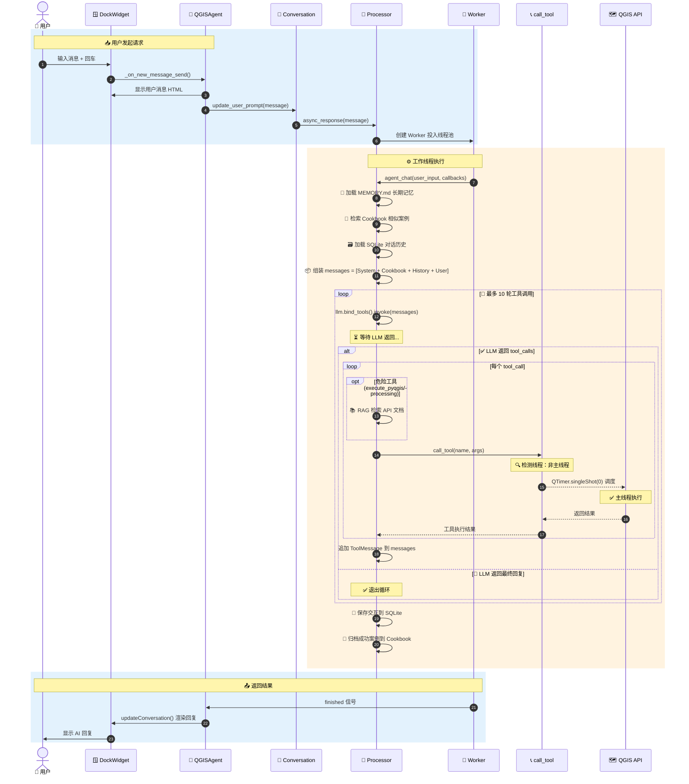
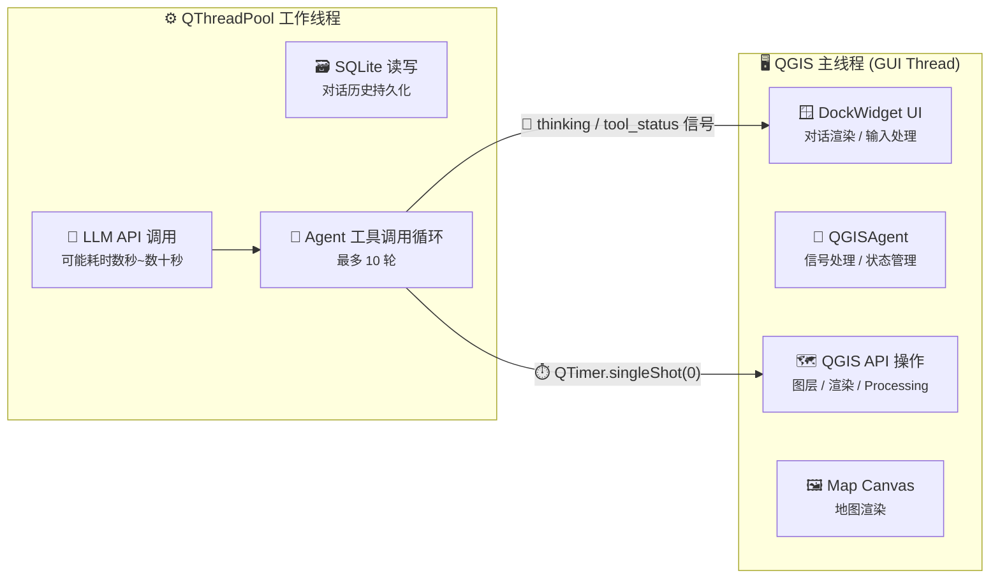
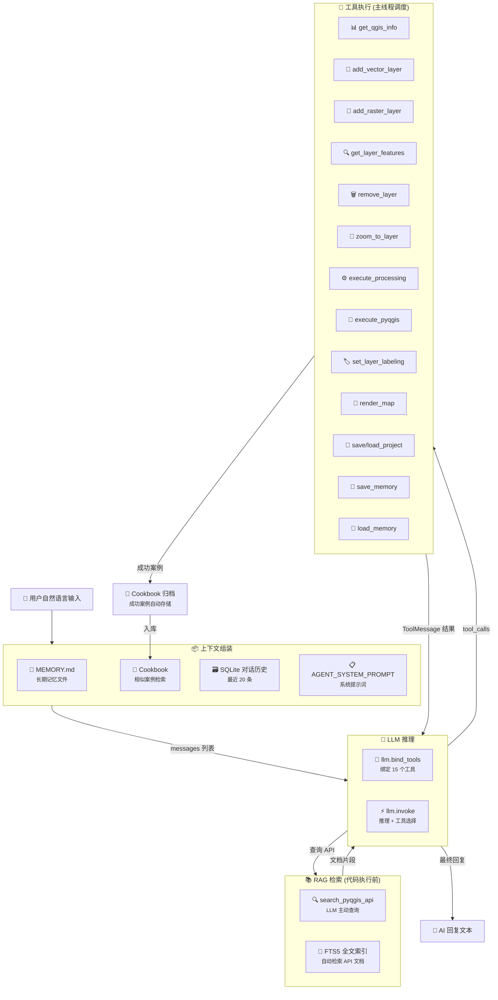

# QGIS Agent

> 🗺️ 将大语言模型 (LLM) 嵌入 QGIS 的智能助手插件 —— 用自然语言操控 QGIS 完成地理空间任务。

[](https://qgis.org/)
[](https://www.python.org/)
[](CHANGELOG.md)
[](LICENSE)

---

## 🎯 一句话简介

QGIS Agent 是 QGIS 的 AI 原生插件——用自然语言直接操控 QGIS，无需编写 PyQGIS 代码。集成 **RAG API 文档检索**和 **Cookbook 自我进化**，让 AI 写的代码更准确、越用越聪明。

## ✨ 核心亮点

| 亮点 | 说明 |
|------|------|
| 📚 **RAG API 文档检索** | 本地 SQLite FTS5 全文引擎，执行代码前自动查询 PyQGIS API 签名和参数，大幅降低"写错参数"的概率 |
| 🧬 **Cookbook 自我进化** | 成功任务自动归档为案例，下次执行前检索相似案例注入上下文，越用越准确 |
| 🔒 **代码安全确认** | 执行 PyQGIS/Processing 前弹窗确认，杜绝误操作 |
| 🧵 **线程安全** | LLM 调用在工作线程执行，QGIS API 操作通过 QTimer 调度回主线程，UI 零阻塞 |
| 🧠 **多模型** | 支持 DeepSeek、OpenAI、GLM、Gemini、MiMo 等所有 OpenAI 兼容 API |

## 🏗️ 架构概览


## 调用流程



## 线程模型



> **核心设计原则**：
> - LLM API 调用在工作线程中执行，**不阻塞 QGIS 主线程 UI**
> - 所有 QGIS API 操作通过 `QTimer.singleShot(0)` 调度回主线程执行，**保证线程安全**
> - 工作线程通过信号/槽同步等待主线程执行结果，超时 60 秒

## 数据流



## 功能特性

| 分类 | 功能 | 说明 |
|------|------|------|
| 💬 交互 | 自然语言操控 QGIS | 输入中文指令，AI 自动选择工具执行 |
| 🧰 工具 | 15 个内置 QGIS 工具 | 图层管理、空间分析、地图渲染、API 检索等 |
| 🧠 模型 | 多 LLM 支持 | DeepSeek、OpenAI、GLM、Gemini、MiMo 等 |
| 📚 RAG | API 文档检索 | 本地 SQLite FTS5 引擎，代码执行前自动查询 PyQGIS API 签名 |
| 🧬 进化 | Cookbook 自我进化 | 成功案例自动归档，下次执行前检索相似案例 |
| 🧵 架构 | 线程安全 | LLM 调用不阻塞 UI，QGIS API 通过 QTimer 调度回主线程 |
| 💾 存储 | 对话持久化 | SQLite 存储完整对话历史，支持检索与恢复 |
| 📝 记忆 | 长期记忆 | 跨对话记忆，AI 记住偏好和工作习惯 |
| 🔒 安全 | 代码安全确认 | 执行 PyQGIS/Processing 前弹窗确认 |
| 🌡️ 可控 | Temperature 控制 | UI 滑块调节 LLM 输出创造性 |
| 🌐 国际化 | 中英文界面 | i18n 翻译文件支持 |

## 📥 安装

### Windows

```powershell
# 1. 复制到 QGIS 插件目录
Copy-Item -Recurse qgis_agent\ "$env:APPDATA\QGIS\QGIS3\profiles\default\python\plugins\qgis_agent"

# 2. 安装依赖（使用 QGIS 内置 Python）
& "C:\Program Files\QGIS 3.x\bin\python-qgis.bat" -m pip install -r "$env:APPDATA\QGIS\QGIS3\profiles\default\python\plugins\qgis_agent\requirements.txt"

# 3. 重启 QGIS，在 插件 → 管理和安装插件 中启用 QGIS Agent
```

### macOS / Linux

```bash
cp -r qgis_agent/ ~/.local/share/QGIS/QGIS3/profiles/default/python/plugins/
pip install -r ~/.local/share/QGIS/QGIS3/profiles/default/python/plugins/qgis_agent/requirements.txt
```

> **推荐**：也可通过 QGIS 插件管理器 → 从 ZIP 安装，插件会自动处理依赖。

## ⚙️ 配置

1. 打开 QGIS，点击工具栏 **QGIS Agent** 图标
2. 切换到「模型配置」标签页
3. 添加 LLM 配置：
   - **名称**：任意（如 `DeepSeek`）
   - **API 端点**：如 `https://api.deepseek.com/v1`
   - **API Key**：你的密钥
4. 也可通过环境变量配置：`DEEPSEEK_API_KEY`、`OPENAI_API_KEY` 等

## 🚀 快速上手

在 QGIS Agent 面板输入框中输入自然语言指令：

| 示例指令 | 效果 |
|----------|------|
| `添加图层 D:/data/roads.shp` | 加载矢量图层到当前项目 |
| `查看当前项目有哪些图层` | 列出所有图层及属性 |
| `对建筑图层按高度字段分级设色` | 自动设置分级符号化渲染 |
| `以 selected_layer 为输入做 100m 缓冲区` | 执行缓冲区空间分析 |
| `将地图渲染导出为 PNG` | 导出当前地图画布截图 |

> 💡 **提示**：AI 在执行 PyQGIS 代码前会自动检索 API 文档，确保参数准确。你也可以直接说"查一下 buffer 的 API 签名"。

## 🔧 内置工具

| 工具 | 功能 | 分类 |
|------|------|------|
| `get_qgis_info` | 获取 QGIS 项目信息、图层列表 | 📊 查询 |
| `get_layer_features` | 查询图层要素属性 | 📊 查询 |
| `add_vector_layer` | 添加矢量图层 | 📂 图层管理 |
| `add_raster_layer` | 添加栅格图层 | 📂 图层管理 |
| `remove_layer` | 移除图层 | 📂 图层管理 |
| `zoom_to_layer` | 缩放到图层范围 | 🔎 导航 |
| `set_layer_labeling` | 设置图层标注 | 🏷️ 标注 |
| `execute_processing` | 执行 Processing 算法 | ⚙️ 空间分析 |
| `execute_pyqgis` | 执行任意 PyQGIS 代码 | 🐍 高级操作 |
| `search_pyqgis_api` | 🆕 检索 PyQGIS API 文档 | 📚 RAG |
| `render_map` | 渲染地图截图 | 📸 输出 |
| `save_project` | 保存 QGIS 项目 | 💾 项目 |
| `load_project` | 加载 QGIS 项目 | 💾 项目 |
| `save_memory` | 保存长期记忆 | 🧠 记忆 |
| `load_memory` | 加载长期记忆 | 🧠 记忆 |

## 📁 项目结构

```
qgis_agent/
├── qgis_agent.py                # 主控制器（含 RAG 初始化）
├── processor.py                 # LLM Agent 核心（集成 RAG + Cookbook）
├── qgis_tools.py                # 工具集 + 线程桥 + 代码确认 + API 检索
├── conversation.py              # 对话会话管理
├── response_worker.py           # 多线程 Worker
├── dataloader.py                # SQLite 数据层
├── llm_providers.py             # LLM 提供商工厂
├── utils.py / config.py         # 工具函数 / 全局配置
├── package_manager.py           # 依赖管理
├── rag/                         # 📚 RAG 模块
│   ├── doc_store.py             #   SQLite FTS5 文档存储
│   ├── retriever.py             #   API 文档检索器
│   ├── doc_generator.py         #   API 文档生成器
│   └── cookbook.py              #   Cookbook 自我进化
├── scripts/build_api_index.py   # 构建 API 索引
├── data/pyqgis_api.db           # API 文档数据库（自动生成）
├── resources/prompt.json        # 提示词模板
├── help/                        # Sphinx 中文文档
├── i18n/                        # 国际化翻译
├── tests/                       # 单元测试
├── metadata.txt                 # QGIS 插件元数据
└── requirements.txt             # Python 依赖
```

## ❓ FAQ

<details>
<summary><b>Q: 首次使用需要联网吗？</b></summary>

- 插件本身**完全本地运行**。首次构建 API 文档索引时会提示，约 10-30 秒
- LLM 调用需要联网（调用你配置的 API 端点）
</details>

<details>
<summary><b>Q: RAG 检索会增加多少延迟？</b></summary>

- FTS5 全文检索耗时 **< 50ms**，对整体响应时间几乎无影响
</details>

<details>
<summary><b>Q: Cookbook 会占用多少存储？</b></summary>

- 每个案例约 2-5KB，1000 个案例约 2-5MB，存储在 `data/pyqgis_api.db` 中
</details>

<details>
<summary><b>Q: 支持哪些 QGIS 版本？</b></summary>

- QGIS 3.0+，推荐 3.28 LTR 或更新版本
</details>

<details>
<summary><b>Q: 如何贡献 API 文档？</b></summary>

- 运行 `scripts/build_api_index.py` 可重新构建索引
- 在 `rag/doc_generator.py` 的 `MANUAL_DOCS` 中添加补充文档
</details>

## 📄 许可

[MIT](LICENSE)
