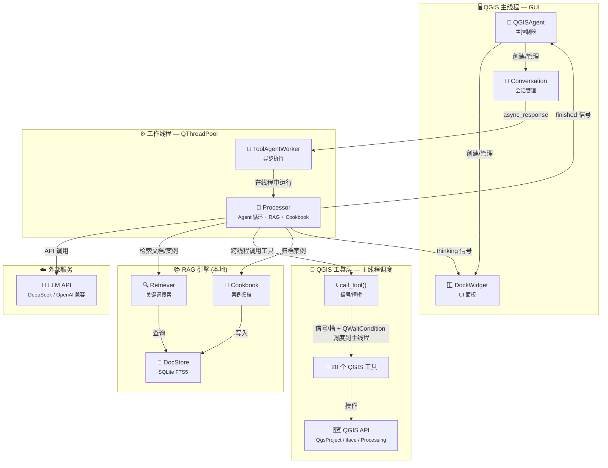

# QGIS Agent

> 🗺️ 将大语言模型 (LLM) 嵌入 QGIS 的智能助手插件 —— 用自然语言操控 QGIS 完成地理空间任务。

[](https://qgis.org/)
[](https://www.python.org/)
[](CHANGELOG.md)
[](LICENSE)

---

## 🎯 一句话简介

QGIS Agent 是 QGIS 的 AI 原生插件——用自然语言直接操控 QGIS，无需编写 PyQGIS 代码。集成 **RAG API 文档检索**和 **Cookbook 自我进化**，让 AI 写的代码更准确、越用越聪明。

## ⚠️ 功能状态说明（请先读这段）

本项目文档同时包含**当前可用功能**与**历史路线图笔记**。为避免「装了才发现用不了」，下表状态以代码接线情况为准：

| 状态 | 含义 | 涉及功能 |
|------|------|----------|
| ✅ **可用** | 已接入主对话链路，当前版本真实可用 | 自然语言操控、**20 个**内置工具、RAG 检索、tool_docs（679 条）、Cookbook、SmartDebugger、Query Tuning、多模型、代码审查（确认弹窗）、技能系统（`run_skill`）、工作流录制回放、主动澄清、任务图 |
| ⚠️ **安全注意** | 可用但非完整沙箱 | `execute_pyqgis`：AST 静态扫描 + 内建白名单 + 用户确认，但仍在 QGIS 进程内执行，请勿把不可信提示当绝对隔离 |

> 状态判定依据：代码是否被主对话链路引用，而非模块是否存在。工具清单以 `qgis_tools.TOOL_MAP` / `TOOL_DEFINITIONS` 为唯一真源。

## ✨ 核心亮点

| 亮点 | 说明 |
|------|------|
| 📚 **RAG API 文档检索** | 本地 SQLite FTS5 全文引擎，执行代码前自动查询 PyQGIS API 签名和参数 |
| 🧬 **Cookbook 自我进化** | 按工作流实际成功/失败归档案例，下次执行前检索相似案例注入上下文 |
| 📖 **官方 API 文档** | 首次运行时自动构建 API 文档索引（含官方 API 文档源，覆盖核心类完整方法签名） |
| 🔒 **代码安全确认** | 执行 PyQGIS/Processing 前弹窗确认；AST 扫描补齐 `open`/`getattr` 等黑名单，内建改白名单 |
| 🧵 **线程安全** | LLM 调用在工作线程执行，QGIS API 通过信号/槽 + `QWaitCondition` 调度回主线程（桥接幂等） |
| 🧠 **多模型** | 支持 DeepSeek、OpenAI、GLM、Gemini、MiMo 等所有 OpenAI 兼容 API |
| 🐛 **SmartDebugger** ✅ | 工具调用失败时自动诊断，并把诊断结论回灌 LLM 改写重试 |
| 📊 **Task Graph** ✅ | 复杂目标拆解为可跟踪计划（`task_graph.py`，默认关闭） |
| 🎯 **Query Tuning** ✅ | 用户查询优化，自动分解 GIS 任务 |
| 📋 **Tool Docs** ✅ | **679 条** QGIS Processing 算法/工具参考（TOML），已接入 RAG |
| 🔍 **Code Review** ✅ | 确认弹窗可附带 LLM 代码审查意见（`code_reviewer.py`） |
| 🔌 **Skills 系统** ✅ | 内置/用户技能通过 `run_skill` 工具调用（`skills/`） |
| 🔄 **Workflow** ✅ | 工作流录制与回放（`workflow_store.py` / `workflow_recorder.py` / `workflow_executor.py`） |
| ❓ **Clarification** ✅ | 意图不明确时主动向用户澄清（`clarification_manager.py`） |

> ✅ = 已接入主对话链路。工具数量以 `TOOL_MAP` 为准，当前为 **20** 个。

## 🏗️ 架构概览


```mermaid
graph TB
    subgraph UI["🖥️ QGIS 主线程 — GUI"]
        direction LR
        A["🧩 QGISAgent<br/><small>主控制器</small>"]
        B["🪟 DockWidget<br/><small>UI 面板</small>"]
        C["💬 Conversation<br/><small>会话管理</small>"]
    end

    subgraph WORKER["⚙️ 工作线程 — QThreadPool"]
        direction LR
        D["🔧 ToolAgentWorker<br/><small>异步执行</small>"]
        E["🧠 Processor<br/><small>Agent 循环 + RAG + Cookbook</small>"]
    end

    subgraph TOOLS["🔩 QGIS 工具层 — 主线程调度"]
        direction LR
        F["📞 call_tool()<br/><small>信号/槽桥</small>"]
        G["🧰 20 个 QGIS 工具"]
        H["🗺️ QGIS API<br/><small>QgsProject / iface / Processing</small>"]
    end

    subgraph RAG["📚 RAG 引擎 (本地)"]
        direction LR
        J["📖 DocStore<br/><small>SQLite FTS5</small>"]
        K["🔍 Retriever<br/><small>关键词搜索</small>"]
        L["🧬 Cookbook<br/><small>案例归档</small>"]
    end

    subgraph EXT["☁️ 外部服务"]
        I["🤖 LLM API<br/><small>DeepSeek / OpenAI 兼容</small>"]
    end

    A -->|创建/管理| B
    A -->|创建/管理| C
    C -->|async_response| D
    D -->|在线程中运行| E
    E -->|API 调用| I
    E -->|检索文档/案例| K
    K -->|查询| J
    E -->|跨线程调用工具| F
    F -->|"信号/槽 + QWaitCondition 调度到主线程"| G
    G -->|操作| H
    E -->|归档案例| L
    L -->|写入| J
    E -->|thinking 信号| B
    E -->|finished 信号| A
```

## 🆕 v2.3.x 重要更新

- ✅ **QGIS 3.22–4.x / Qt5+Qt6 兼容**
- ✅ **Skills / Workflow / Clarification / Code Review 已接线**（v2.3.0）
- ✅ **浏览器兼容 TLS（可选）**：接口在 TLS 握手阶段被网关中断时，可改用 curl_cffi 的浏览器 TLS 栈重试（v2.3.2）
- ✅ **MCP 服务出口（可选）**：把内置工具通过 MCP 协议提供给 Claude Desktop / Cursor 等外部 Agent。默认关闭，仅监听 127.0.0.1 并强制令牌校验，特权工具默认不放行（v2.4.0）
- 🔒 **安全加固（文档同步后继续优化）**：`execute_pyqgis` AST 黑名单补齐 `open`/`getattr`，内建白名单；桥接幂等防工具重复执行；Cookbook 按实际成败归档

详见 [CHANGELOG.md](CHANGELOG.md)。

## 📥 安装

### 方式一：QGIS ZIP 安装（推荐）

1. 从 [Releases](https://github.com/bunkmr/qgis-agent/releases) 下载最新版 `qgis_agent_vX.X.X.zip`
2. 打开 QGIS → 菜单栏 **插件** → **管理和安装插件**
3. 点击左侧 **从 ZIP 安装**，选择下载的 ZIP 文件
4. 点击 **安装插件**
5. 在已安装列表中勾选启用 **QGIS Agent**

### 方式二：手动安装

#### Windows

```powershell
# 1. 复制到 QGIS 插件目录（QGIS 3 用 QGIS3，QGIS 4 用 QGIS4）
Copy-Item -Recurse qgis_agent\ "$env:APPDATA\QGIS\QGIS3\profiles\default\python\plugins\qgis_agent"

# 2. 重启 QGIS，在 插件 → 管理和安装插件 中启用 QGIS Agent
```

> 💡 QGIS 4 用户请把路径中的 `QGIS3` 改为 `QGIS4`。

#### macOS / Linux

```bash
cp -r qgis_agent/ ~/.local/share/QGIS/QGIS3/profiles/default/python/plugins/
```
> 💡 QGIS 4 用户请把路径中的 `QGIS3` 改为 `QGIS4`（macOS 为 `~/Library/Application Support/QGIS/QGIS4/...`）。


## ⚙️ 配置

1. 打开 QGIS，点击工具栏 **QGIS Agent** 图标
2. 切换到「模型配置」标签页
3. 添加 LLM 配置：
   - **名称**：任意（如 `DeepSeek`）
   - **API 端点**：如 `https://api.deepseek.com/v1`
   - **API Key**：你的密钥

### 支持的 LLM 提供商

| 提供商 | API 端点 | 模型 |
|--------|----------|------|
| DeepSeek | `https://api.deepseek.com/v1` | deepseek-chat, deepseek-reasoner |
| OpenAI | `https://api.openai.com/v1` | gpt-4o, gpt-4o-mini |
| 智谱 GLM | `https://open.bigmodel.cn/api/paas/v4/` | glm-4, glm-4-flash |
| Google | `https://generativelanguage.googleapis.com/v1beta/openai/` | gemini-2.0-flash |
| 小米 MiMo | `https://api.xiaomimimo.com/v1/chat/completions` | mimo-v2.5 |
| 自定义 | 任何 OpenAI 兼容接口 | 任意模型名 |
| 本地部署 | `http://localhost:11434/v1` 等 | 任意模型名（Ollama / vLLM / llama.cpp） |

> 🔑 **本地 / 自托管模型无需密码**：自定义端点的 **API Key 可留空**。部分网关后的端点会返回 `403 PermissionDenied` 并提示请求被拦截——插件会发送一个常规浏览器 `User-Agent` 以提高兼容性，通常无需手动改配置。

## 🚀 快速上手

在 QGIS Agent 面板输入框中输入自然语言指令：

| 示例指令 | 效果 |
|----------|------|
| `添加图层 D:/data/roads.shp` | 加载矢量图层到当前项目 |
| `查看当前项目有哪些图层` | 列出所有图层及属性 |
| `对建筑图层按高度字段分级设色` | 自动设置分级符号化渲染 |
| `以 selected_layer 为输入做 100m 缓冲区` | 执行缓冲区空间分析 |
| `将地图渲染导出为 PNG` | 导出当前地图画布截图 |

> 💡 **提示**：AI 在执行 PyQGIS 代码前会自动检索 API 文档，确保参数准确。

## 🔧 内置工具

| 工具 | 功能 | 分类 |
|------|------|------|
| `get_qgis_info` | 获取 QGIS 项目信息、图层列表 | 📊 查询 |
| `get_layer_features` | 查询图层要素属性 | 📊 查询 |
| `add_vector_layer` | 添加矢量图层 | 📂 图层管理 |
| `add_raster_layer` | 添加栅格图层 | 📂 图层管理 |
| `remove_layer` | 移除图层 | 📂 图层管理 |
| `zoom_to_layer` | 缩放到图层范围 | 🔎 导航 |
| `set_layer_labeling` | 设置图层标注 | 🏷️ 标注 |
| `execute_processing` | 执行 Processing 算法 | ⚙️ 空间分析 |
| `execute_pyqgis` | 执行任意 PyQGIS 代码 | 🐍 高级操作 |
| `search_pyqgis_api` | 检索 PyQGIS API 文档 | 📚 RAG |
| `render_map` | 渲染地图截图 | 📸 输出 |
| `save_project` | 保存 QGIS 项目 | 💾 项目 |
| `load_project` | 加载 QGIS 项目 | 💾 项目 |
| `save_memory` | 保存长期记忆 | 🧠 记忆 |
| `load_memory` | 加载长期记忆 | 🧠 记忆 |
| `get_algorithm_parameters` | 查询 Processing 算法的参数定义 | 📚 RAG |
| `get_layer_profile` | 生成图层数据概览（字段、范围等） | 📊 查询 |
| `set_layer_renderer` | 设置图层渲染样式（分级设色等） | 🎨 渲染 |
| `reproject_layer` | 图层投影转换 | ⚙️ 空间分析 |
| `run_skill` | 加载并运行内置/用户技能 | 🔌 技能 |

> 共 **20** 个内置工具，与代码中 `qgis_tools.TOOL_DEFINITIONS` / `TOOL_MAP` 保持一致。

## 📚 RAG 文档覆盖

RAG 系统包含两类文档，**两者口径不同，请勿混用数字**：

**① 随包分发的 Processing 算法/工具参考（静态、可精确统计）**

| 项目 | 数量 | 说明 |
|------|------|------|
| `tool_docs/*.toml` | **679** | 每个 QGIS Processing 算法一份 TOML 参考（参数、返回值、示例）。统计口径：`ls tool_docs/*.toml \| wc -l` |
| `tool_docs_index.json` | 679 条对应索引 | 供 RAG 快速检索 |

**② 运行时构建的 PyQGIS API 文档（动态、随 QGIS 版本变化）**

| 来源 | 数量 | 说明 |
|------|------|------|
| 官方 API 文档 | 运行时构建 | 核心类的完整方法签名（QgsVectorLayer, QgsGeometry, QgsFeature 等），首次运行由 official_doc_scraper / doc_generator 生成 |
| 运行时反射 | 运行时反射生成 | 从当前 QGIS 运行时提取的方法签名（随版本/环境变化，无固定值） |
| Processing 算法 | 等于当前 QGIS 已安装算法数 | 非固定值 |
| 手动补充 | 11 | 常用操作速查 |

> 说明：早期文档中的「380+ API 文档」是运行时索引的**估算值**，无法静态核实且与上面的 679 条算法参考不是同一口径，已移除。
> 对外宣传请统一使用：**679 个 Processing 算法/工具文档条目**（`tool_docs/` 实际文件数）。

### 覆盖的核心类

- **QgsVectorLayer** (17 methods) - 矢量图层操作
- **QgsGeometry** (16 methods) - 几何操作
- **QgsProject** (11 methods) - 项目管理
- **QgsCoordinateReferenceSystem** (9 methods) - 坐标系
- **QgsFeature** (9 methods) - 要素操作
- **QgsMapCanvas** (7 methods) - 地图画布
- **QgsApplication** (2 methods) - 应用程序

## 📁 项目结构

```
qgis_agent/
├── qgis_agent.py                # 主控制器（含 RAG 初始化）
├── processor.py                 # LLM Agent 核心（集成 RAG + Cookbook）
├── qgis_tools.py                # 工具集 + 线程桥 + 代码确认 + API 检索
├── conversation.py              # 对话会话管理
├── response_worker.py           # 多线程 Worker
├── dataloader.py                # SQLite 数据层
├── llm_providers.py             # LLM 提供商工厂
├── code_reviewer.py             # 代码审查（确认弹窗）
├── smart_debugger.py            # 错误诊断与重试
├── clarification_manager.py     # 模糊请求澄清
├── workflow_store.py            # 工作流录制/回放
├── task_graph.py                # 任务图拆解
├── utils.py / config.py         # 工具函数 / 全局配置
├── package_manager.py           # 依赖管理
├── rag/                         # 📚 RAG 模块
│   ├── doc_store.py             #   SQLite FTS5 文档存储
│   ├── retriever.py             #   API 文档检索器
│   ├── doc_generator.py         #   API 文档生成器
│   ├── official_doc_scraper.py  #   📖 官方 API 文档
│   └── cookbook.py               #   Cookbook 自我进化
├── skills/                      # 🔌 技能系统（已接入 run_skill）
│   ├── skill_manager.py         #   技能管理器
│   ├── builtins.py              #   内置技能（网络搜索等）
│   └── user_skills/             #   用户自定义技能
├── scripts/build_api_index.py   # 构建 API 索引
├── tests/                       # 单元测试
├── metadata.txt                 # QGIS 插件元数据
└── requirements.txt             # Python 依赖
```

> 历史实验模块 `agent_loop/` 已从主链路移除（仅残留 pycache，勿再依赖）。

## 🔌 技能系统

技能通过 `run_skill` 工具暴露给 LLM，可加载内置技能或 `skills/user_skills/*.py`。

### 内置技能

| 技能 | 功能 |
|------|------|
| `web_search` | 网络搜索（DuckDuckGo/Google/Bing） |
| `gis_data_search` | GIS 数据源搜索 |
| `format_results` | 格式化搜索结果 |

### 自定义技能

```python
from skills.skill_manager import Skill, SkillResult

def handler(**kwargs):
    # 你的逻辑
    return SkillResult(success=True, output="结果")

SKILL = Skill(
    name="my_skill",
    description="技能描述",
    handler=handler,
)
```

> ⚠️ 用户技能会在 QGIS 进程内以当前用户权限执行。只放入你信任的代码；生产环境建议限制可调用技能白名单。

## ❓ FAQ

<details>
<summary><b>Q: 首次使用需要联网吗？</b></summary>

- 插件本身**完全本地运行**。首次构建 API 文档索引时会提示，约 10-30 秒
- LLM 调用需要联网（调用你配置的 API 端点）
</details>

<details>
<summary><b>Q: RAG 检索会增加多少延迟？</b></summary>

- FTS5 全文检索耗时 **< 50ms**，对整体响应时间几乎无影响
</details>

<details>
<summary><b>Q: Cookbook 会占用多少存储？</b></summary>

- 每个案例约 2-5KB，1000 个案例约 2-5MB，存储在 `data/pyqgis_api.db` 中
</details>

<details>
<summary><b>Q: 支持哪些 QGIS 版本？</b></summary>

- QGIS 3.22+ 与 4.x（PyQt5 / PyQt6 双兼容），推荐 3.28 LTR 或 4.x 新版
</details>

<details>
<summary><b>Q: 如何贡献 API 文档？</b></summary>

- 运行 `scripts/build_api_index.py` 可重新构建索引
- 在 `rag/doc_generator.py` 的 `MANUAL_DOCS` 中添加补充文档
- 在 `rag/official_doc_scraper.py` 中添加官方 API 文档
</details>

## 📄 许可

[MIT](LICENSE)

---

**如果这个项目对你有帮助，请给个 ⭐ Star 支持一下！**
